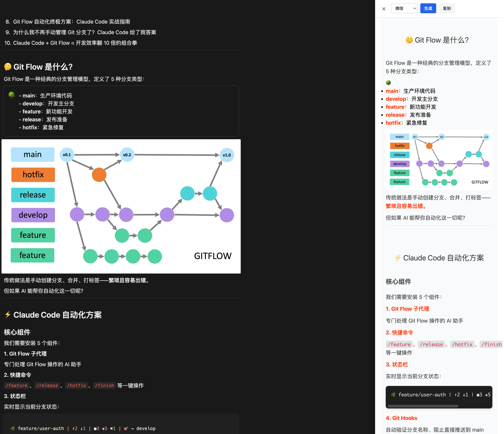

<div align="center">
  
  <h1>Notion2WeChat</h1>
  <p>一键将 Notion 文章转换为微信公众号格式的 Chrome 扩展</p>
  
  <p>
    <a href="https://github.com/your-username/notion2wechat/stargazers">
      
    </a>
    <a href="https://github.com/your-username/notion2wechat/blob/main/LICENSE">
      
    </a>
    <a href="https://github.com/your-username/notion2wechat/releases">
      
    </a>
  </p>
</div>

## 🌟 简介

Notion2WeChat 是一款专为内容创作者设计的 Chrome 浏览器扩展，能够将 Notion 中的文章一键转换为微信公众号可发布的格式。通过智能解析、样式优化和图片处理，显著提升内容发布效率，让您的创作更加专注。

## 🚀 特性

- 🔄 **一键转换** - 快速将 Notion 文章转换为微信公众号格式
- 🎨 **多主题支持** - 内置 6 种精美主题（默认、微信、红绯、简黑、山吹、橙心）
- 👁️ **实时预览** - 侧边栏实时预览转换效果
- 🖼️ **智能图片处理** - 自动处理 Notion 图片 URL 并转换为可访问链接
- 📋 **一键复制** - 一键复制并自动打开公众号后台
- 💻 **代码高亮** - 支持代码块语法高亮显示
- 📱 **响应式设计** - 适配不同屏幕尺寸的预览界面

## 📷 效果展示



*实际效果更佳，支持多种主题样式切换*

## 📦 安装方式

### Chrome Web Store (推荐)
1. 访问 [Chrome 网上应用店](https://chrome.google.com/webstore)
2. 搜索 "Notion2WeChat"
3. 点击 "添加至 Chrome" 按钮完成安装

### 开发者模式安装
```bash
# 克隆项目
git clone https://github.com/your-username/notion2wechat.git

# 进入项目目录
cd notion2wechat

# 安装依赖
pnpm install

# 构建项目
pnpm run build
```

然后在 Chrome 浏览器中：
1. 打开 `chrome://extensions/`
2. 开启"开发者模式"
3. 点击"加载已解压的扩展程序"
4. 选择项目中的 `dist` 文件夹

## 🛠️ 使用方法

1. 在 Notion 中打开要转换的文章页面
2. 点击页面右侧的蓝色插件图标
3. 在侧边栏中选择喜欢的主题样式
4. 点击"生成"按钮，等待内容转换完成
5. 在预览区域查看转换效果
6. 点击"复制"按钮，自动复制内容
7. 打开微信公众号后台，直接粘贴即可

## 🧰 技术栈

- **语言**: [TypeScript](https://www.typescriptlang.org/)
- **构建工具**: [Vite](https://vitejs.dev/)
- **样式框架**: [Tailwind CSS](https://tailwindcss.com/)
- **浏览器标准**: [Chrome Extension Manifest V3](https://developer.chrome.com/docs/extensions/mv3/)
- **Markdown解析**: [Marked.js](https://marked.js.org/)
- **代码高亮**: [Highlight.js](https://highlightjs.org/)
- **CSS内联**: [Juice](https://github.com/Automattic/juice)
- **包管理**: [pnpm](https://pnpm.io/)

## 📁 项目结构

```
notion2wechat/
├── src/
│   ├── background/       # 后台脚本
│   ├── content/          # 内容脚本（核心功能）
│   ├── types/            # TypeScript 类型定义
│   └── utils/            # 工具函数
│       ├── imageProcessor.ts  # 图片处理逻辑
│       ├── markdown.ts        # Markdown 解析和转换
│       └── themes.ts          # 主题样式管理
├── public/               # 静态资源和 manifest.json
├── dist/                 # 构建输出目录
├── package.json          # 项目配置和依赖
└── vite.config.ts        # 构建配置
```

## 🎨 主题样式

插件内置 6 种精美主题，满足不同风格需求：

| 主题 | 预览 |
|------|------|
| 默认 | 简洁大方的默认样式 |
| 微信 | 商务风格的蓝色主题 |
| 红绯 | 热情洋溢的红色主题 |
| 简黑 | 酷炫个性的黑色主题 |
| 山吹 | 温暖明亮的黄色主题 |
| 橙心 | 活力四射的橙色主题 |

## 🔧 开发指南

```bash
# 安装依赖
pnpm install

# 开发模式（热重载）
pnpm run dev

# 构建生产版本
pnpm run build

# 代码检查
pnpm run lint

# 代码格式化
pnpm run format
```

## 🤝 贡献

欢迎任何形式的贡献！请先阅读我们的[贡献指南](CONTRIBUTING.md)。

1. Fork 本仓库
2. 创建您的特性分支 (`git checkout -b feature/AmazingFeature`)
3. 提交您的更改 (`git commit -m 'Add some AmazingFeature'`)
4. 推送到分支 (`git push origin feature/AmazingFeature`)
5. 开启一个 Pull Request

## 📄 许可证

本项目采用 MIT 许可证。详情请见 [LICENSE](LICENSE) 文件。

## 🙏 致谢

- [Marked.js](https://marked.js.org/) - Markdown 解析器
- [Highlight.js](https://highlightjs.org/) - 代码语法高亮
- [Juice](https://github.com/Automattic/juice) - CSS 内联工具
- 感谢这些主题的原作者，无法一一联系在此致谢
- 所有为项目贡献过代码的[贡献者们](https://github.com/your-username/notion2wechat/graphs/contributors)

## 📞 联系我们

如有任何问题或建议，请通过以下方式联系我们：

- 提交 [Issue](https://github.com/your-username/notion2wechat/issues)
- 发送邮件至 [your-email@example.com](mailto:your-email@example.com)