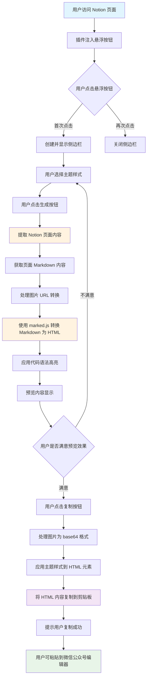
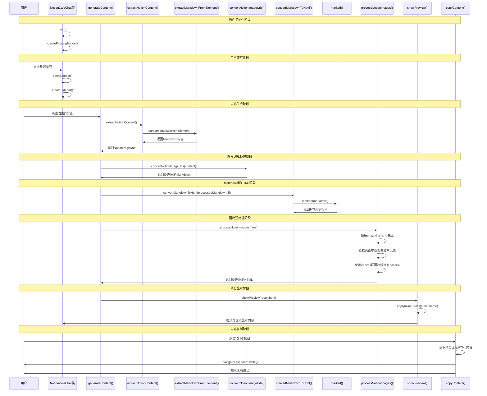

# Notion2WeChat 插件工作流程

## 流程图

## 详细工作流程

## UML 时序图

### 1. 初始化阶段
- 插件在 Notion 页面加载时注入内容脚本
- 创建悬浮按钮并监听点击事件
- 加载可用的主题样式

### 2. 用户交互阶段
- 用户点击悬浮按钮，显示侧边栏界面
- 用户可选择不同的主题样式（默认、蓝色、红色等）
- 用户点击"生成"按钮触发内容转换

### 3. 内容提取阶段
- 通过 DOM 操作找到 Notion 页面内容容器
- 使用剪贴板 API 模拟用户复制操作获取 Markdown 格式内容
- 提取页面标题和内容

### 4. 内容转换阶段
- 处理 Notion 图片 URL，尝试将 attachment 格式转换为标准的 Notion 图片 URL
 - 查找 Markdown 中的 attachment 格式图片链接，如 `attachment:uuid:image.png`
  - 提取页面 ID 信息（从 Markdown 内容中匹配 32 位十六进制字符串）
  - 将 attachment 格式转换为标准的 Notion 图片 URL，格式为：`https://www.notion.so/image/{encodeURIComponent(fileName)}?id={pageId}&table=block&width=1024&userId=v&cache=v2`
  - 处理其他 Notion 图片 URL 格式，如 `file.notion.so` 到 `www.notion.so/image` 的转换
  - 注意：这个步骤生成的 URL 仍然需要身份验证才能访问，实际显示图片依赖后续的 canvas 转换过程
- 使用 marked.js 库将 Markdown 转换为 HTML
  - 在 `src/utils/markdown.ts` 文件的 `convertMarkdownToHtml` 函数中，第 77 行调用 `marked(markdown)` 进行转换
  - 该函数在 `src/content/index.ts` 的第 360 行被调用：`const result = await convertMarkdownToHtml(processedMarkdown, [])`
 - 应用自定义渲染器处理特殊元素（标题、代码块、引用等）
  - 对代码块进行语法高亮处理

### 5. 预览显示阶段
- 将转换后的 HTML 应用所选主题样式
- 在侧边栏预览区域显示转换后的内容
- 处理图片显示问题，确保预览中图片正确加载

### 6. 内容复制阶段
- 用户点击"复制"按钮
- 将预览内容转换为适合微信公众号编辑器的 HTML 格式
- 将图片转换为 base64 格式以确保在公众号编辑器中正确显示
- 使用 Clipboard API 将 HTML 内容写入剪贴板

### 7. 输出阶段
- 提示用户复制成功
- 用户可在微信公众号编辑器中直接粘贴内容

## 关键技术点

### 图片处理机制
1. **URL 预处理**: 在 Markdown 转换为 HTML 前，尝试将 Notion 的 attachment 格式图片 URL 转换为标准的 Notion 图片 URL
   - 识别 `attachment:uuid:filename` 格式的图片链接
   - 尝试从 Markdown 内容中提取 32 位页面 ID
   - 如果找到页面 ID，则将 attachment 格式转换为标准的 Notion 图片 URL
   - 如果未找到页面 ID，则 attachment 格式保持不变
   - 注意：此步骤生成的 URL 仍然需要身份验证才能访问，并不能直接显示图片

2. **预览处理**: 在预览阶段，通过 canvas 技术将页面中的图片转换为 base64 以确保正确显示
   - 调用 `processNotionImages` 函数处理转换后的 HTML
   - 遍历预览 HTML 中的所有 `` 元素
   - 对于 attachment 格式的图片，通过 `findMatchingImage` 函数在当前页面中查找匹配的图片元素
   - 使用 canvas API 将找到的原始图片转换为 base64 数据 URI，并更新 `` 标签的 src 属性
   - 实际上，显示图片的关键步骤是通过 canvas 将原网页中的图片转换为 base64，而不是之前 URL 转换步骤

3. **复制处理**: 确保图片以适合微信公众号的格式输出
   - 复制时使用预览区域的 HTML 内容（其中部分图片已转换为 base64）
   - 当前实现中只有 attachment 格式的图片被转换为 base64，其他图片仍为需要身份验证的 URL
   - 这可能导致复制到微信公众号编辑器的图片无法正常显示
   - 理想情况下，所有图片都应该从原网页中匹配并转换为 base64，以确保在微信编辑器中正常显示

### 主题系统
1. **CSS 解析**: 解析主题 CSS 规则，提取选择器和样式
2. **内联样式**: 将 CSS 样式转换为内联样式，确保在微信公众号编辑器中生效
3. **动态切换**: 支持实时切换不同主题并更新预览

### 代码高亮
1. **自定义渲染**: 使用 marked.js 的自定义渲染器处理代码块
2. **语法识别**: 识别不同编程语言并应用相应高亮规则
3. **内联样式**: 使用内联样式确保在公众号编辑器中保持高亮效果